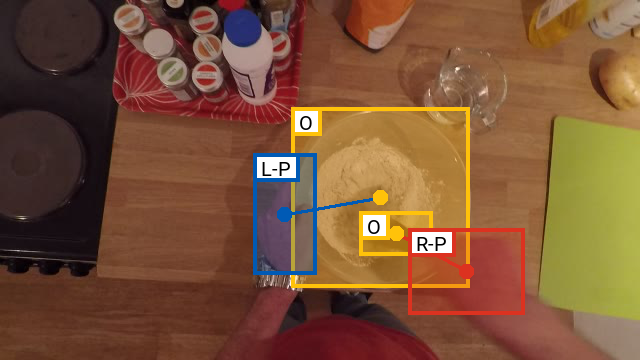

# EPIC Hand-object detections
[](https://epic-hand-object-detections.readthedocs.io/en/latest/?badge=latest)

This repository contains a supporting library for using the hand-object
detections we extracted from
[ddshan/Hand_Object_Detector](https://github.com/ddshan/Hand_Object_Detector)
(CVPR 2020).



## Library

This repository contains supporting code for using hand-object detections which are
stored in binary protobuf files. The schema can be found in [`src/public_lib/types.proto`](./src/public_lib/types.proto).

Install the library like so:

```console
$ python setup.py install
```

To hack on it, just install with

```console
$ python setup.py develop
```

and edit the files within the repo.

## Downloads

We provide the detections for all frames in EPIC Kitchens. These are avaiable to
download from [data.bris]().

## Model setup

We ran the code with
- weights: https://drive.google.com/open?id=1H2tWsZkS7tDF8q1-jdjx6V9XrK25EDbE
- hand threshold: 0.1
- object threshold: 0.01

We opted for lower hand and object thresholds than have been judged optimal, this is so 
that you, as a user, can decide what threshold (down to those that we extracted features
at) to use for objects and hands without having to re-extract detections on the whole 
dataset.

We have found the following settings to produce good qualitative results:
- hand threshold: 0.5
- object threshold: 0.5
 
